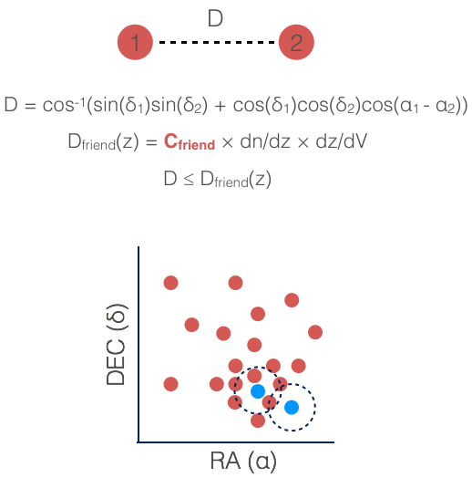
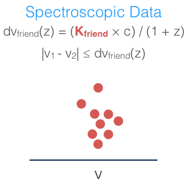
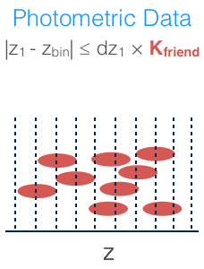

# Super Friends-of-Friends (SFoF): Galaxy Cluster Detection Algorithm

> Author: **Samuel Farrens**  
> Email: **[samuel.farrens@cea.fr](mailto:samuel.farrens@cea.fr)**  
> Version: **4.0**  

## Contents

1. [Introduction](#Introduction)
1. [Notice](#Notice)
1. [Contributors](#Contributors)
1. [Scientific Background and Method](#Scientific-Background-and-Method)
   1. [Angular Percolation](#pAngular-Percolation)
   1. [Redshift Binning](#Redshift-Binning)
   1. [Line-of-Sight Linking](#Line-of-Sight-Linking)
   1. [Cluster Properties](#Cluster-Properties)
   1. [Optimisation](#Optimisation)
1. [Installation and Execution](./docs/readme.md)
1. [Examples](./examples/)
1. [Doxygen Documentation](http://sfarrens.github.io/sfof/)

## Introduction
SFoF is a friends-of-friends galaxy cluster detection algorithm that operates in
either spectroscopic or photometric redshift space. The linking parameters,
both transverse and along the line-of-sight, change as a function of
redshift to account for selection effects.

The code is written in C++ and implements OMP to loop through the
photometric redshift bins.

Larger catalogues can be split into overlapping pieces using the
`cat_split.cpp` code. These pieces can than be run through the FoF
independently and the subsequent results merged using the `cat_merge.cpp`
code.

## Notice

This software is fully open source and all are welcome to use or modify it for
any purpose.

I would kindly request that any scientific publications making use of this software cite [Farrens et. al (2011)](http://adsabs.harvard.edu/abs/2011MNRAS.417.1402F).

## Contributors

The vast majority of this code has been written from scratch by Samuel Farrens. Additional contributions have been made by:

* Filipe Abdalla - (debugging, concepts and ideas)
* Eduardo Cypriano - (proto-code, concepts and ideas )
* Stefano Sartor - (optimisation)
* Luca Tornatore - (optimisation)

## Scientific Background and Method

This section provides a brief summary of how SFoF works. In particular, how the percolation is handled both across the sky and along the line-of-sight. More comprehensive details can be found in [Farrens et. al (2011)](http://adsabs.harvard.edu/abs/2011MNRAS.417.1402F).

### Angular Percolation

Unlike a standard FoF this algorithm percolates in angular space.

The angular distance in radians between two galaxies (*D*) is calculated as shown in the figure on the right. Where  and  correspond to right ascension and declination, respectively.

For two galaxies in a given redshift bin to be considered friends (*i.e.* linked) they must satisfy the following condition:

where  is the transverse linking length in radians for a given redshift bin.

### Redshift Binning

This section is only relevant for `fof_mode=dynamic`.

The first task the code performs is to bin all of the input galaxies by redshift. This is used to calculate  where  is the number of galaxies in a given bin and  is the bin width. Each galaxy is only counted once for this calculation, thus for photometric data the peak photometric redshift value of the galaxy is used.

> NOTE: If a predefined  is provided, then these values are used for the  calculation.

The differential comoving volume as a function of redshift, , and the angular diameter distance, , are then calculated for each bin using the values of ,  and  provided.

Finally the angular linking length, , for each bin is defined as:

where  is:

 is the specified reference redshift and  is the input transverse linking parameter. This calculation ensures that:

and that for bins with less galaxies (*e.g.* at higher redshifts when selection effects have a stronger impact) the value of  will increase, while for bins with more galaxies the value of  will decrease. This produces  values that are more redshift independent.

### Line-of-Sight Linking

**• Spectroscopic Data**

In the spectroscopic mode the line-of-sight linking length is calculated as follows:

For two galaxies to be friends they must satisfy:

In this sense the percolation is performed in 3 dimensions.

**• Photometric Data**

In the photometric mode a galaxy is allocated to a redshift bin if it satisfies the following:

In this case  is a factor that determines how much the galaxies smear along the line-of-sight.

In this mode percolation is performed in 2 dimensions for each redshift bin independently. As galaxies can exist in multiple bins it is possible to form "proto-clusters" in different bins with similar members.

When the percolation has finished for all of the bins proto-clusters with common members are merged to form the final detections.

### Cluster properties

**• Centre**

The cluster centre (*RA, Dec, z*) is calculated as the median of the galaxy members. The errors are calculated as the standard error on the median (*i.e.* ).

**• Richness**

The cluster richness is calculated a the number of member galaxies.

**• Singal-to-Noise**

The cluster singal-to-noise ratio is calculated as follows:

where  is the cluster area and  is the background level at the cluster redshift. Unless an  is provided, the code simply takes the number of objects at the cluster redshift divided by the catalogue area as .

**• Radius**

The cluster radius, , is calculated as the distance from the cluster center to the position of the farthest member in the units specified.

**• Area**

The cluster area is calculated as:

in the units specified.

### Optimisation

**• k-d Tree**

The code make us of an angular [*k-d* Tree](https://en.wikipedia.org/wiki/K-d_tree) (implemented by Luca Tornatore) to reduce the number of calculations required.

**• Union-Find**

The code also makes use of a [union-find data structure](https://en.wikipedia.org/wiki/Disjoint-set_data_structure) (implemented by Stefano Sartor) to speed up the processes of merging proto-clusters.

**• OpenMP**

[OpenMP](https://en.wikipedia.org/wiki/OpenMP) is used to perform the redshift bin percolations in parallel.

**• Splitting**

The `cat_split.cpp` code can be used to divide large data sets into overlapping pieces that can be processed individually. The `cat_merge.cpp` code can then reassemble the full catalogue using the results with little to no loss of information.
